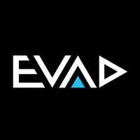

# INFORMACIÓN PROVISIONAL

# Presentaciones duales de 1º DAW, 1º DAM, 1ºSMR y 1º ASIR del curso 2025 / 2026

Horarios, índices a las carpetas y normas para las presentaciones de alumnos duales de **1º DAM** (Desarrollo de Aplicaciones Multiplataforma), **1º DAW** (Desarrollo de Aplicaciones Web), **1º ASIR** (Administración de Sistemas Informáticos) y **1ºSMR** (Sistemas Microinformáticos y Redes) del **CPIFP Alan Turing** (Málaga - PTA) del curso 2025 - 2026.

## Índice

* [Horario de las presentaciones con índices a las carpetas](#horario-de-las-presentaciones-con-índices-a-los-repositorios)
  * [1ASIR](#1asir)
  * [1DAW, 1DAM mañana](#1daw-1dam-turno-de-mañana)
  * [1DAW, 1DAM tarde](#1daw-1dam-turno-de-tarde)
  * [1SMR](#1smr)
    
* [Tiempo para la presentación](#stopwatch-tiempo-para-la-presentación)
* [Contenido de la presentación](#open_file_folder-contenido-de-la-presentación)
* [Formato de la presentación](#bookmark_tabs-formato-de-la-presentación)
* [Lugar de la presentación](#school-lugar-de-la-presentación)

## :calendar: Horario de las presentaciones con índices a los repositorios

Cada alumno debe enlazar con el repositorio donde tiene su presentación (formato elegido y pdf), además de cualquier otra información que considere relevante.

### 1ASIR
### Por motivos organizativos, este curso se hará una presentación en vídeo individual.

* [Lisa Jeannette Báez Lezcano]()
* [María del Carmen Calvo Verdaguer]()
* [Raúl Plaza Chatulani]()

* [José Carlos Bueno Gálvez]()

* [Óscar Manuel Díaz García]()

* [Óscar Gutiérrez Quintana]()

* [Aitor Jerez Clemente]()

* [Alejandro Rafael Liñán Tagliaferri]()

* [Javier Ordóñez De la Higuera]()

* [María Ordóñez López]()
* [Ricardo Sánchez Zaragoza]()

* [Juan Antonio Ruiz Gómez]()

### 1DAW
#### :calendar: TBD

* Hora de comienzo: TBD

### 1DAM
#### :calendar: TBD

* Hora de comienzo: TBD

### 1SMR
#### :calendar: TBD

* Hora de comienzo: TBD

## :stopwatch: Tiempo para la presentación

Para cada turno (mañana y tarde), los alumnos de la misma empresa deberán de realizar una presentación común de ella cuya duración será de 5 minutos como máximo. Si se trata de un único alumno/a en la empresa, deberá igualmente realizar la presentación de la misma. A continuación, cada alumno realizará una presentación individualizada de su trabajo de 5 minutos, dejando otros 5 minutos para un turno de preguntas común.

El documento de presentación de cada empresa puede ser común para todos los alumnos que hayan realiazado la formación dual en ella, independientemente del turno (mañana o tarde) y del cilo formativo.

Ejemplo de temporización para el grupo de Elsa Pato de 1º DAW y Víctor Tazo de 1º DAM la empresa Turing Tech:

* 5 minutos para la presentación común de la empresa Turing Tech
* 5 minutos para la presentación individual de Elsa Pato 
* 5 minutos para la presentación individual de Víctor Tazo
* 5 minutos para el turno de preguntas

## :open_file_folder: Contenido de la presentación

La presentación debe tener, como mínimo, el siguiente contenido:

* Introducción a la empresa. Se debe hacer en común cuando en la misma empresa hay varios alumnos.
* Tareas desempeñadas con temporalización por semanas.
* Herramientas utilizadas.
* Conocimientos adquiridos por cada módulo profesional.
* Valoración de la experiencia dual por parte del alumno.

## :bookmark_tabs: Formato de la presentación

Se puede utilizar cualquier herramienta para elaborar la presentación. El alumno se puede apoyar en material multimedia si lo considera oportuno.

Independientemente de la herramienta utilizada para crear y mostrar la presentación, debe haber una versión en pdf en el repositorio.

Cualquier material utilizado en la presentación debe estar disponible desde el mismo repositorio: presentación original, presentación en formato pdf, enlaces a videos, etc.

## :school: Lugar de la presentación

Las presentaciones **SON PRESENCIALES** y tendrán lugar en el **Salón de actos del CPIFP Alan Turing** sita en C/ Frederick Terman,3. 29590, PTA.

Si te ha resultado útil este repositorio, por favor dale una :star: ¡Gracias!

